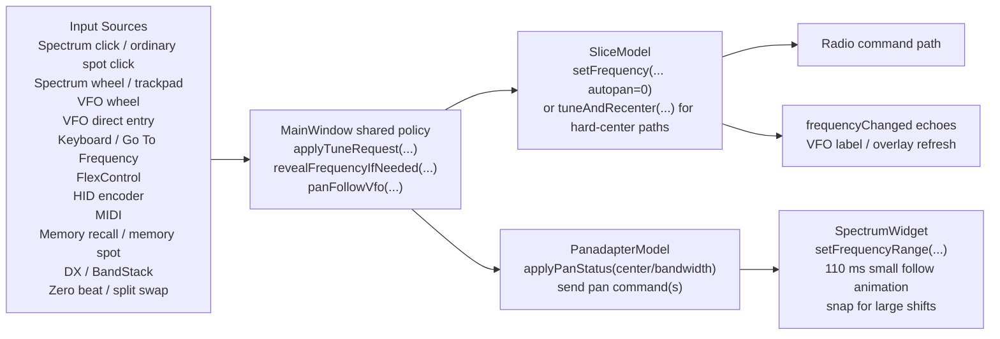

# Recenter Architecture

This document describes the current pan-follow / recenter architecture implemented in the `aether/recenter-policy` worktree.

It is intentionally a description of the code as it exists today, not an aspirational rewrite. The goal is to give future review and iteration work a stable reference point.

## Why This Exists

The current implementation centralizes tuning and reveal policy in `MainWindow` so we can make pan-follow and recenter behavior more consistent across input modalities without rewriting the radio/tuning subsystem before 1.0.

The architecture is deliberately:

- low risk
- localized
- Qt-native
- cross-platform
- compatible with existing `SliceModel`, `PanadapterModel`, and `SpectrumWidget` responsibilities

## Primary Files

- `src/gui/MainWindow.h`
- `src/gui/MainWindow.cpp`
- `src/gui/SpectrumWidget.h`
- `src/gui/SpectrumWidget.cpp`
- `src/gui/VfoWidget.h`
- `src/gui/VfoWidget.cpp`
- `src/models/SliceModel.h`
- `src/models/SliceModel.cpp`
- `src/models/PanadapterModel.h`
- `src/models/PanadapterModel.cpp`

## High-Level Structure

At a high level:

1. UI surfaces emit intent-shaped tuning signals.
2. `MainWindow` resolves the target slice and applies a shared tuning policy.
3. `SliceModel` performs the actual frequency command.
4. `MainWindow` optionally applies reveal/pan-follow on the owning panadapter.
5. `PanadapterModel` and `SpectrumWidget` handle center/bandwidth state and animation.

## Core Policy Object

The shared policy lives in `MainWindow` and is expressed through:

- `TuneIntent`
- `applyTuneRequest(...)`
- `applyPanRangeRequest(...)`
- `revealFrequencyIfNeeded(...)`
- `panFollowVfo(...)`
- `logTunePolicyDecision(...)`

### `TuneIntent`

`MainWindow::TuneIntent` currently has five values:

- `IncrementalTune`
- `AbsoluteJump`
- `CommandedTargetCenter`
- `ExplicitPan`
- `RevealOffscreen`

The important architectural decision is that the tuning subsystem itself was not rewritten. Instead, `MainWindow` classifies caller intent and decides whether the requested frequency should only tune, tune-and-follow, tune-and-reveal, tune-and-center a commanded target, or remain a pure user-driven pan action.

## Ownership Boundaries

### `SpectrumWidget`

`SpectrumWidget` is responsible for:

- converting user gestures into signals
- maintaining local visual pan state
- animating small center nudges in `setFrequencyRange(...)`
- preserving explicit pan and zoom behavior

It is not responsible for deciding whether a gesture should reveal or recenter. That policy decision was moved upward into `MainWindow`.

### `VfoWidget`

`VfoWidget` is responsible for:

- emitting incremental wheel tuning via `stepTuneRequested(...)`
- emitting committed direct entry via `directEntryCommitted(...)`, including the source tag used for policy logging
- letting both ordinary VFO entry and keyboard `Go To Frequency` share the same commanded-center commit behavior
- leaving reveal / recenter policy to `MainWindow`

### `SliceModel`

`SliceModel` still owns the actual frequency command behavior:

- `setFrequency(...)` sends `slice tune <id> <freq> autopan=0`
- `tuneAndRecenter(...)` sends `slice tune <id> <freq>` without `autopan=0`

This is a critical architectural boundary: the shared policy prefers `setFrequency(...)` plus client-side reveal logic, and only leaves a few intentional hard-center paths on `tuneAndRecenter(...)`.

### `PanadapterModel`

`PanadapterModel` remains the source of center/bandwidth state and emits `infoChanged(center, bandwidth)`. `MainWindow` may optimistically call `applyPanStatus(...)` before the radio echo arrives so the UI can repaint immediately.

## End-to-End Tuning Flow

### Shared path

For the policy-controlled paths, the flow is:

1. Resolve a target slice.
2. Call `applyTuneRequest(slice, mhz, intent, source)`.
3. If unlocked, update the active overlay/VFO immediately when appropriate.
4. Call `SliceModel::setFrequency(...)`.
5. Mirror diversity-child visuals if needed.
6. Apply either:
   - `panFollowVfo(...)` for `IncrementalTune`
   - `revealFrequencyIfNeeded(...)` for all non-incremental shared reveal / center paths
7. Emit concise debug logging.

### Explicit pan/zoom path

Explicit pan/zoom interactions do not use `applyTuneRequest(...)`. They continue to emit:

- `centerChangeRequested(...)`
- `bandwidthChangeRequested(...)`
- `frequencyRangeChangeRequested(...)`

Those signals now route through a small explicit pan/zoom path in `MainWindow` so combined center+bandwidth changes can be sent as one coherent radio command while preserving current user-driven semantics.

## Intent Semantics

### 1. `IncrementalTune`

Used for stepwise tuning inputs where the user expects frequency motion without repeated dead-centering.

Current examples:

- spectrum wheel
- spectrum trackpad scroll
- VFO drag in spectrum
- VFO wheel
- keyboard arrows
- FlexControl
- HID encoder
- MIDI relative
- MIDI absolute fallback
- zero beat
- split swap

Current behavior:

- tune via `SliceModel::setFrequency(...)`
- use client-side reveal/pan-follow
- do not dead-center
- obey the `PanFollowVfo` setting

Current constants in `MainWindow.cpp`:

- incremental trigger edge margin: `0.12`
- incremental settle edge margin: `0.18`
- small follow animation target: `110 ms`

Operationally:

- if the tuned frequency remains inside the trigger window, no recenter happens
- once it crosses the trigger fence, pan follow uses the configured step size as its nudge quantum when that step is available
- the center moves in step-sized increments only far enough to bring the slice back to the trigger boundary, instead of jumping straight to the settle boundary
- the older settle target is still used as a safety cap and as the fallback when no step size is available

### 2. `AbsoluteJump`

Used for jump-style frequency requests where the destination may be far away but should not always be hard-centered.

Current examples:

- same-pan click-to-tune
- cross-pan click-to-tune
- ordinary spot click
- DX cluster tune
- BandStack recall
- off-screen "Move Slice Here"

Current behavior:

- prefer `SliceModel::setFrequency(...)`
- call shared reveal logic only if the target is off-screen or too close to the visible edge
- avoid double-centering
- keep already-visible spot clicks and other contextual jumps from being forced back to pan center

Reveal behavior uses the current comfort edge margin:

- reveal comfort edge margin: `0.18`

### 3. `CommandedTargetCenter`

Used for deliberate command-style jumps where the target frequency should become the pan center, not merely be revealed.

Current examples:

- VFO direct entry commit
- keyboard `Go To Frequency` commit
- memory quick recall
- Memory dialog recall
- memory spot click
- memory post-apply timeout fallback

Current behavior:

- tune via `SliceModel::setFrequency(...)`
- apply a single shared center decision in `MainWindow` after the tune request
- keep tune and center ordering coupled inside the shared policy path
- reuse the same optimistic pan update and `SpectrumWidget::setFrequencyRange(...)` animation/snap behavior as other shared center changes
- use the same intent whether the commanded target came from VFO direct entry, keyboard `Go To Frequency`, a memory UI surface, or a memory spot on the panadapter

### 4. `ExplicitPan`

This exists in the enum as a policy category, and current explicit pan and zoom gestures intentionally stay outside the shared tune helper path.

Those gestures still operate through:

- `SpectrumWidget::frequencyRangeChangeRequested(...)`
- `SpectrumWidget::centerChangeRequested(...)`
- `SpectrumWidget::bandwidthChangeRequested(...)`

Current behavior:

- combined zoom operations use `applyPanRangeRequest(...)` in `MainWindow`
- `MainWindow` optimistically updates `PanadapterModel` with both center and bandwidth together
- `MainWindow` sends one `display pan set ... center=... bandwidth=...` command for that explicit range change
- pure pan drags still use center-only commands
- pure bandwidth-only controls can still use bandwidth-only commands when no center change is involved
- combined center+bandwidth updates were added specifically to avoid the waterfall-loss / zoom-drift bug class caused by sending those two values separately for one visual operation

This preserves user-driven pan/zoom semantics rather than layering auto-follow on top of them, while avoiding transient split states between center and bandwidth during explicit zoom operations.

### 5. `RevealOffscreen`

Used when a slice becomes the active context but is not currently visible.

Current example:

- `setActiveSliceInternal(..., revealOffscreen=true)`

Current behavior:

- active slice changes still happen through the existing active-slice machinery
- if the slice is off-screen, `revealFrequencyIfNeeded(...)` is used to bring it into view predictably
- explicit "Center Slice" actions remain hard-center and are not downgraded to reveal-only behavior

## Current Signal Map

### `SpectrumWidget` -> `MainWindow`

Current signal split:

- `frequencyClicked(double mhz)` -> absolute jump
- `incrementalTuneRequested(double mhz)` -> incremental tune
- `frequencyRangeChangeRequested(double center, double bw)` -> explicit combined pan/zoom
- `centerChangeRequested(double center)` -> explicit pan
- `bandwidthChangeRequested(double bw)` -> explicit zoom / bandwidth control
- `sliceTuneRequested(int sliceId, double freqMhz)` -> absolute jump for "Move Slice Here"

Notable gesture sources in `SpectrumWidget`:

- non-memory spot click emits `frequencyClicked(...)`
- memory spot click emits `spotTriggered(...)` so the recall path can own tune-and-center ordering
- memory spots intentionally bypass the generic `frequencyClicked(...)` path to avoid an immediate reveal followed by a delayed centered memory confirm
- single-click tune emits `frequencyClicked(...)`
- double-click tune emits `frequencyClicked(...)`
- VFO drag emits `incrementalTuneRequested(...)`
- wheel and trackpad scroll emit `incrementalTuneRequested(...)`
- pan drag emits `centerChangeRequested(...)`
- pinch zoom emits `frequencyRangeChangeRequested(...)`
- bandwidth drag emits `frequencyRangeChangeRequested(...)`
- zoom buttons emit `frequencyRangeChangeRequested(...)`
- off-screen "Center Slice" emits `centerChangeRequested(...)` directly and remains an explicit center

### `VfoWidget` -> `MainWindow`

- `stepTuneRequested(double mhz)` -> `IncrementalTune`
- `directEntryCommitted(double mhz, QString source)` -> `CommandedTargetCenter`
- `zeroBeatRequested()` -> tuned through shared incremental behavior in `MainWindow`
- `swapRequested()` -> tuned through shared incremental behavior in `MainWindow`

## Cross-Pan Target Resolution

Cross-pan tuning is resolved in `wirePanadapter(...)` using a local `resolveSpectrumTuneTarget` helper.

Current behavior:

- determine the panadapter that owns the gesture
- if the active slice is already on that pan, use it
- otherwise choose a slice whose `panId()` matches that pan

Important implementation detail:

- cross-pan spectrum tune now defers the active-slice switch using `queueActiveSliceForSpectrumTarget(...)`
- the tune itself is still applied immediately to the resolved slice
- the visible active-slice handoff happens on the next event-loop turn

This was added as a low-risk mitigation to avoid synchronous active-pan/widget churn inside the spectrum event handler.

## Reveal Algorithm

`revealFrequencyIfNeeded(...)` is the central reveal helper.

It currently:

1. reads the owning `PanadapterModel`
2. derives the visible half-bandwidth
3. computes trigger and settle distances based on intent
4. decides whether the target is too close to an edge
5. computes a new center only when needed
6. applies the center optimistically with `PanadapterModel::applyPanStatus(...)`
7. sends the matching radio command

For small shifts:

- `SpectrumWidget::setFrequencyRange(...)` animates the center change over `110 ms`

For larger shifts or bandwidth changes:

- `SpectrumWidget::setFrequencyRange(...)` snaps immediately

The widget already has architecture to distinguish a small follow nudge from a large shift:

- small shift -> animate
- large shift or bandwidth change -> cancel animation and snap

## Logging

`logTunePolicyDecision(...)` emits policy diagnostics with:

- source
- intent
- old frequency
- new frequency
- old center
- new center
- bandwidth
- whether follow/reveal triggered
- whether a hard center was used
- animation duration

This is meant for behavior verification and regression tracing rather than permanent analytics.

## Current Call-Site Classification

### Shared incremental policy

These currently route through `applyTuneRequest(..., IncrementalTune, ...)`:

- FlexControl
- MIDI relative
- HID encoder
- spectrum wheel / trackpad scroll
- spectrum VFO drag
- VFO wheel
- keyboard arrows
- zero beat
- split swap
- MIDI absolute fallback

### Shared absolute jump/reveal policy

These currently route through `applyTuneRequest(..., AbsoluteJump, ...)`:

- spectrum click-to-tune
- cross-pan click-to-tune
- ordinary spot click
- DX cluster tune
- BandStack recall
- off-screen "Move Slice Here"

### Shared commanded-center policy

These currently route through `applyTuneRequest(..., CommandedTargetCenter, ...)` or the same intent after radio confirmation:

- VFO direct entry
- keyboard `Go To Frequency`
- quick memory recall
- Memory dialog recall
- memory spot click
- memory recall post-apply reveal / timeout

### Shared reveal-only path

These currently route through shared reveal logic without becoming hard-center:

- active-slice switch when the slice is off-screen

### Shared explicit pan/zoom path

These currently route through `applyPanRangeRequest(...)` when center and bandwidth should move together:

- spectrum zoom buttons
- spectrum pinch zoom
- spectrum bandwidth drag
- keyboard panadapter zoom `+` / `-`

### Explicit center actions that stay hard-center

These remain true center operations:

- `centerActiveSliceInPanadapter(...)`
- off-screen "Center Slice"
- off-screen double-click center

## Memory Recall Architecture

Memory recall needed special treatment because the final tuned frequency may not be locally authoritative at the moment the memory is applied.

Current approach:

- `activateMemorySpot(...)` sends `memory apply`
- it records `m_pendingMemoryRevealSliceId`
- if a `frequencyChanged(...)` arrives for that slice, shared commanded-center logic runs using the actual resulting frequency
- a timeout fallback runs if the radio echo is delayed

This avoids guessing the post-memory frequency too early.

Important signal-routing detail:

- ordinary spots and memory spots no longer share the same first-hop tune signal
- ordinary spots stay on the reveal-oriented `AbsoluteJump` path
- memory spots go straight to memory recall handling so the eventual centered recall is the only tune/recenter decision for that click

## Spot Behavior Summary

The current design intentionally splits spot behavior into two categories:

- ordinary spots are contextual tune targets and use `AbsoluteJump`
- memory spots are command-style recall targets and use `CommandedTargetCenter`

Practical effect:

- clicking a visible ordinary spot should usually keep the current pan unless the target is too close to an edge
- clicking an ordinary spot near an edge should reveal it once, without a hard center
- clicking a memory spot should behave like recalling a known target and end with the target centered
- memory spots should not first do a generic reveal and then later do a second center motion

## Settings and Guards

### `PanFollowVfo`

Current meaning:

- gates incremental auto-follow / reveal
- does not block explicit center actions
- does not block absolute jump reveal behavior where the goal is to make the target visible

### `m_updatingFromModel`

Used to suppress client-side echo loops while applying model-driven UI updates.

### `m_pendingMemoryRevealSliceId`

Tracks a slice waiting for post-memory reveal.

### `m_pendingSpectrumTargetSliceId`

Tracks a queued cross-pan active-slice handoff created from a spectrum gesture.

## Intentional Hard-Center Paths Kept

For lowest risk before 1.0, several paths intentionally remain hard-center:

- band shortcuts
- `restoreBandState(...)`
- unrecognized band fallback in band selection
- explicit center actions

These still use `tuneAndRecenter(...)` or direct center commands on purpose.

## Known Gaps / Remaining Inconsistencies

These paths are still outside the shared policy and should be treated as known follow-up items:

- `src/gui/RxApplet.cpp` still contains a direct-entry `tuneAndRecenter(...)` path

## Design Constraints Preserved

The current architecture intentionally does not:

- redesign the radio/tuning subsystem
- move policy into `SliceModel`
- introduce OS-specific scroll physics
- add spring/inertia behavior beyond existing Qt animation

It does preserve:

- existing `SpectrumWidget::setFrequencyRange(...)` architecture
- `SliceModel` as the owner of tune command emission
- radio-authoritative pan state
- direct user pan/zoom control

## Practical Review Checklist

When reviewing future changes, use this checklist:

- Does the path clearly map to one of the five intents?
- Is the target slice resolved once and consistently?
- Does the path use `setFrequency(...)` unless a true hard-center is intended?
- Could the user see two center operations for one action?
- Does the path preserve explicit pan/zoom semantics?
- Does the path respect `PanFollowVfo` where incremental follow is implied?
- If the target slice is off-screen, is reveal happening with shared logic rather than bespoke code?
- If the path is a spot action, is it clearly classified as ordinary spot reveal or memory spot commanded-center?
- If the path is a memory action, does it avoid an initial generic tune signal plus a second delayed center?
- If a path still hard-centers, is that intentional and documented?

## Suggested Next Iteration Topics

Good follow-up areas for iteration:

- fold remaining direct-entry paths into the shared policy
- decide whether explicit pan/zoom should eventually reuse the tune-policy logging format for consistency
- tighten the boundary between optimistic local UI updates and radio echo updates
- continue validating cross-pan behavior, especially under rapid wheel/trackpad input on macOS
- decide whether hard-center exceptions should shrink further after 1.0 risk drops
